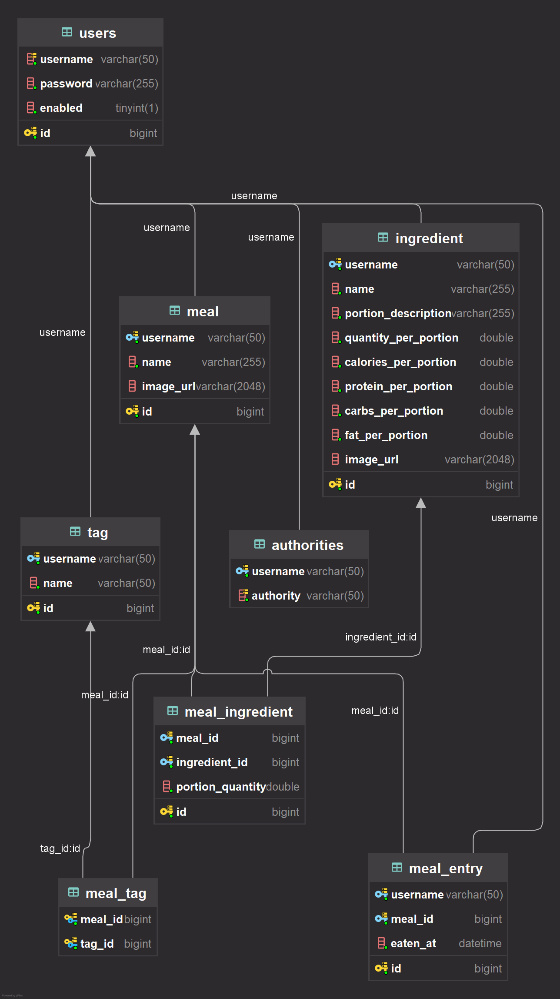

# CalorieTracker
Spring App to track calories

## Spring Boot & Thymeleaf
Server-side rendered (SSR) web application since Spring Boot handles backend logic and Thymeleaf templates are rendered with data passed to them from Spring. MVC structure.

### POM
Using:
- Spring Boot Web (Built in Tomcat)
- Spring Boot ThymeLeaf (For templates and MVC functionnality)
- Spring Boot Dev Tools (Automatic rebuild)
- MySQL Connector (MySQL DB)
- Spring Data JPA (Free DB CRUD)

Not Using:
- Spring Data REST (Automatic REST Endpoints. Lacks granularity. Harder for ThymeLeaf)

## Database Diagram

